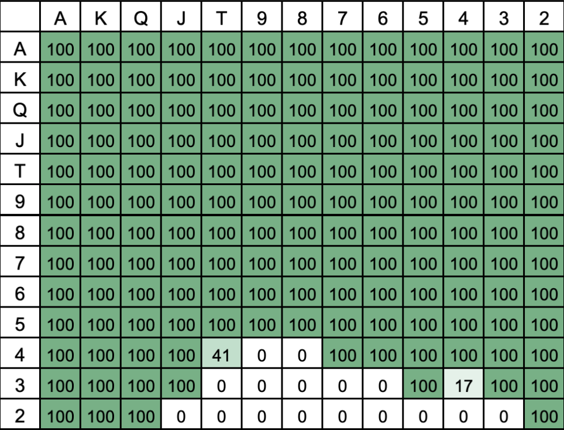
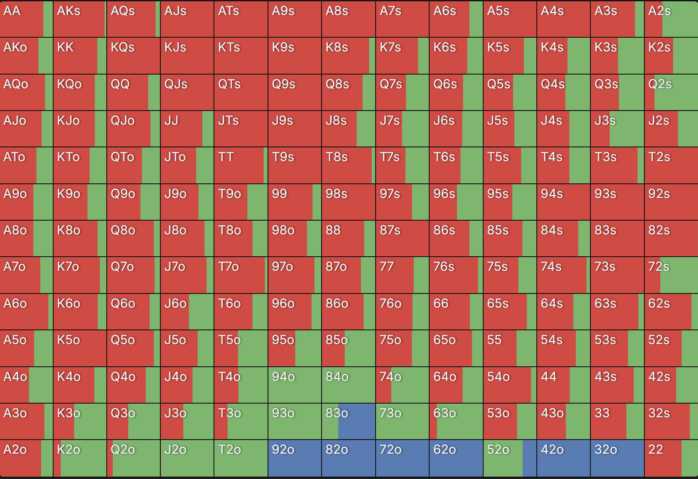
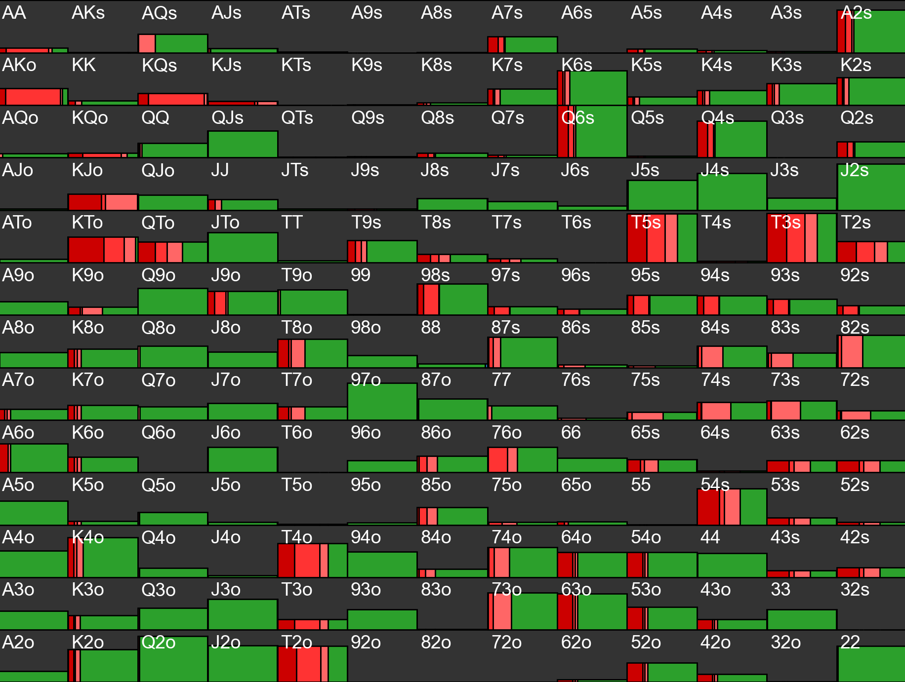
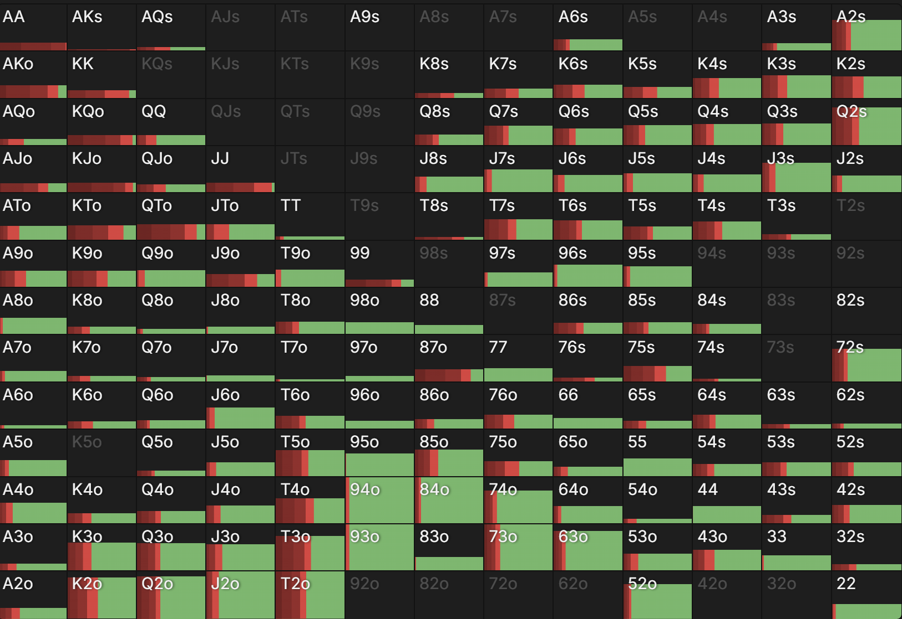

# Antsolver
A heads-up no-limit (HUNL) poker AI built from contemporary research on imperfect-information games. The goal for this project is to achieve elite human-level performance in HUNL, while training entirely on the computing resources found on a laptop. 

This project is inspired by frontier research on large-scale imperfect-information games (see `history/`).

## Structure
The solver follows the abstraction + blueprint + search paradigm used by top models.

### Generate abstraction
- Hand information is abstracted into 169-1000-1000-1000 buckets across streets
- Flop and turn use distribution-aware clustering
- River uses percentile hand strength clustering
- Action abstraction restricts bets to simple percentages of pot 

### Train blueprint strategy
- Nash equilibrium is approximated within abstracted game
- External-sampling MCCFR is used for convergence

### Resolve in real-time
- Subgames are resolved on every street except the preflop
- Depth-limited search solves until the end of each streets using MCCFR

## Installation
### Quick Start

First, clone the repository:

```bash
git clone https://github.com/SlappyPenguin/Antsolver.git
cd Antsolver
```

In order to visualise the solver's solutions, example in-game spots have been provided in `data/` (for more details, see `data/README.md`). Use Python to view the solver's strategy at each spot:    

```bash
cd scripts
python visualiser.py
# Example spot
> Input file name (__.txt): visualise_preflop1
```

### Training pipeline
Requirements for full installation and training:

- g++ with C++20
- make
- At least 32GB RAM
- At least 75GB free disk space

First, compile all programs using the top Makefile:

```bash
make
```

To generate the abstraction (takes ~12 hours):

```bash
cd build
# Precomputes table for hand evaluation
./table
# Card abstraction
./sets
./strengths
./distributions
./preflop_river_clusters
./flop_turn_clusters
# Bet abstraction
./tree
```

To train the blueprint strategy (takes ~5 days to converge):

```bash
cd build
# The next two should be run multiple times
./generator
./trainer
# Reformats blueprint
./reformat
```

Finally, play with or against the AI:

```bash
cd build
./play_with_blueprint
./play_with_search
./play_against_search
```

To create custom spots to visualise:
```bash
cd build
./init_visualiser
```

## Performance
The full solver will play in the standardised version of HUNL used in the Annual Computer Poker Competition:

- $20,000 initial stacks
- $50/$100 blinds
- All integer bet sizes allowed (above min bet)

However, in this first iteration of the solver, off-tree betting actions are not yet allowed. Early testing indicates the bot plays at advanced-amateur strength.

Consider its policy as Small Blind opening preflop:

<p align="center">
  <br>
</p>

Compare this to the strategies of Supremus, a frontier research AI based on neural nets, and GTO Wizard, a state-of-the-art commercial solver.

| | |
|:-:|:-:|
|  |  |
| *Supremus strategy (probability of not folding)* | *GTO Wizard strategy (72BB stacks)* |

While Antsolver uses the precomputed blueprint strategy in the preflop, later subgames are resolved in real-time. Consider its policy as Small Blind after limping preflop, and Big Blind checking a flop of K♠J♠9♣:

| | |
|:-:|:-:|
|  |  |
| *Antsolver strategy* | *GTO Wizard strategy (72BB stacks)* |

## Roadmap
Planned upgrades for the second iteration of the solver:

- Merge gamestate generation with training by branching chance actions in MCCFR
- Implement regret-based pruning to speed up blueprint computation and search
- Respond to off-tree actions using action translation or nested depth-limited search
- Write a full benchmark against Slumbot