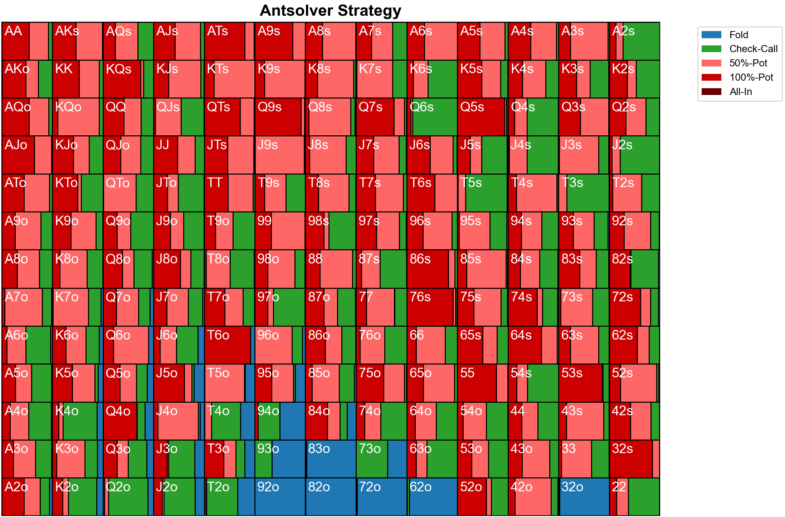

# Antsolver
This is a heads-up no-limit poker AI built from advanced game theory research. The goal for this project is to achieve elite human level performance in heads-up poker, while training entirely on the computing resources found on a laptop. It was inspired by frontier research on imperfect-information games (see `history/`).

## Structure
### Generate abstraction
- Card sets are abstracted into 169-1000-1000-1000 buckets on each street
- On the flop and turn, distribution-aware clustering is used
- On the river, percentile hand strength is used 
- Action abstraction is done by restricting bets to simple percentages of the pot.

### Train blueprint strategy
- In the abstracted game, a Nash equilibrium strategy is approximated
- External-sampling MCCFR is used for convergence

### Real-time search
- When playing with or against the AI, the current subgame is resolved
- Depth-limited solving is used on every street except the preflop

## Installation
First, clone the repository:

```bash
git clone https://github.com/SlappyPenguin/Antsolver.git
cd Antsolver
```

If you just want to access the visualiser, example spots have been provided in `data/`. For more details, see `data/REAME.md`. These can be visualised using Python:

```bash
cd scripts
python visualiser.py
> Input file name (__.txt): visualise_preflop1
```

For full installation, the g++ compiler and at least 32GB of RAM are needed. First, compile all programs using the top Makefile:

```bash
make
```

Run these programs for the abstraction (takes ~12 hours):

```bash
cd build
# Precomputes table for hand evaluation
./table
# Card abstraction
./sets
./strengths
./distributions
./preflop_river_clusters
./flop_turn_clusters
# Bet abstraction
./tree
```

Run these programs to train the blueprint (takes a few days to converge):

```bash
cd build
# Practically, the next two should be run multiple times
./generator
./trainer
# Reformats blueprint
./reformat
```

Finally, play with or against the AI:

```bash
cd build
./play_with_blueprint
./play_with_search
./play_against_search
```

To create custom spots to visualise:
```bash
cd build
./init_visualiser
```

## Performance
In this first iteration of the solver, off-tree betting actions are not yet allowed. Within this simplified game, the bot plays at an advanced amateur level.



...

## Planned Upgrades
Upgrades for the next iteration of the solver:

- Merge game generation with training by branching chance actions in MCCFR
- Implement regret-based pruning to speed up blueprint and search
- Allow for off-tree actions using action translation or nested search
- Write a full benchmark against Slumbot